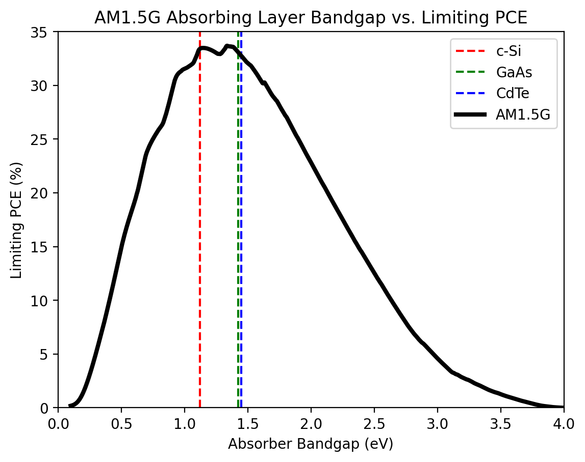

# DBL
Detailed Balance Limit for PV

## Motivation

This repo is dedicated to the detailed balance calculation for AM1.5G limiting PCE  and sub metrics w.r.t. device absorber bandgap

### Demo of resulting calculation

