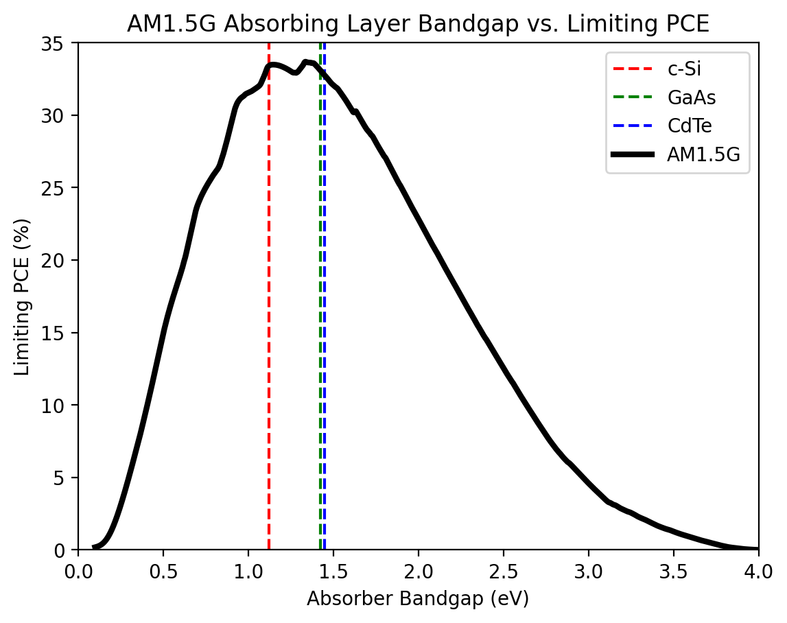
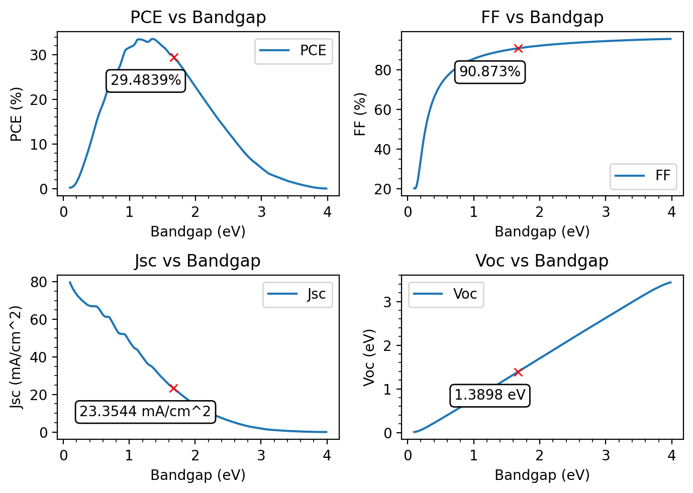

# DBL
Straightforward function that calculates the detailed balance limit (and plots result) for device metrics such as PCE, FF, Voc, Jsc for a desired bandgap under AM1.5G illumination. 

### Demo PCE Calculation

### Demo Calculation of PCE, FF, Jsc, Voc

